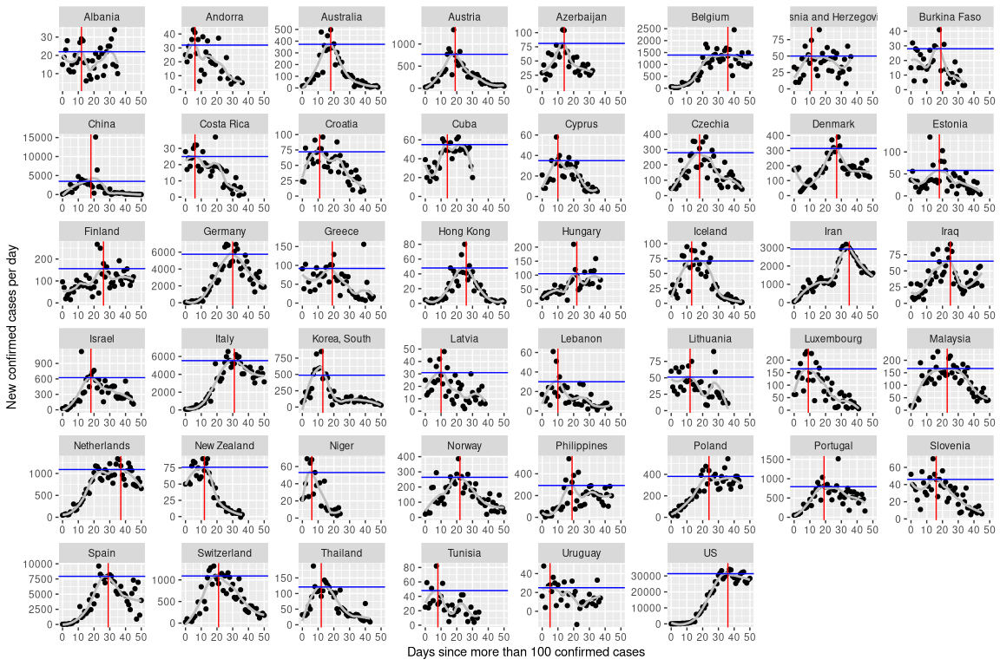

Download data
=============

Data were downloaded from the github repository of the Johns Hopkins
University. These are the same data, from which the famous GIS world map
is created. See:
<a href="https://github.com/CSSEGISandData/COVID-19" class="uri">https://github.com/CSSEGISandData/COVID-19</a>

This was last updated

    ## [1] "2020-04-27"

